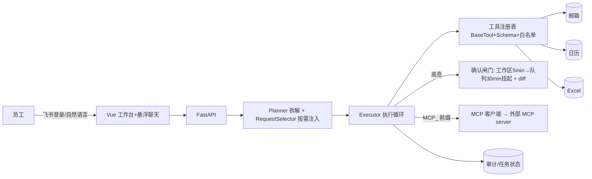

# 面试讲解稿（办公自动化 Agent · 更新版）

> 用法：先背 30 秒版和 3 分钟版 → 理解"为什么" → 对着高频问题练 → 按演示脚本跑一遍。
> 心法：面试官考的是"你懂不懂、能不能讲清、给你需求能不能接着做"，不是背代码。

---

## 一、30 秒版

"我做了个办公自动化 Agent：员工用自然语言提需求，系统拆成子任务、按需调用邮件/日历/表格等工具执行；高危动作（发送/覆盖/删除/修改）先给用户看 diff、人工确认后才执行。带一个可视化工作台和悬浮聊天，还能通过 MCP 协议调用外部工具。"

## 二、3 分钟版

"分四层：
1. **前端**（Vue）：工作台首页（KPI/图表/待确认/最近任务）+ 底部悬浮聊天 + 个人中心
2. **接口层**（FastAPI）：任务 / 确认 / 用户 / 审计 / 聊天 / MCP 工具
3. **编排层**（agent）：LLM 把一句话拆成结构化子任务（动作/对象/高危标记/工具/参数），意图不明反问，多轮续跑判断（MAX_STEPS 防死循环）
4. **执行与安全层**：工具按白名单执行、参数校验；高危动作进两段式确认（工作区内联 5 分钟 → 待确认队列 30 分钟挂起），写盘前展示 old→new diff

整个链路：飞书登录 → 输入 → 拆解（工具按需注入）→ 低危执行 / 高危确认 → 执行 → 反馈（可出图）。全链路审计 + 日志 + 用户隔离。"

## 三、10 分钟版（设计取舍）

- **为什么高危要人工确认**：不可逆操作代价大，确认是信任闸门；而且**确认是业务数据不是框架钩子**——落库、可超时、可审计、可回放
- **为什么表格用表头定位**：模型猜行列会写错列——真实踩过坑（把"电话"写进"备注"列），所以改成模型只输出表头名、系统读表定位，写前 diff 预览
- **为什么拆解用 JSON + temperature=0**：结构化好解析、低随机稳定；不用原生 Tool Calling 是因为不绑定模型 API、能一次输出多步计划
- **为什么工具按需注入（RequestSelector）**：只给模型相关工具的 Schema，省 token、从源头减少选错工具；没识别到就回退全量，宁多勿漏
- **为什么确认分两段**：工作区 5 分钟内顺手点，稍后/超时自动进队列——避免"同一个确认两个地方出现"
- **为什么任务/聊天按用户隔离 + 审计**：多人用不串账，出事能查是谁、何时、对什么做了什么
- **为什么去重 5 分钟、追问 3 轮、续跑 3 轮**：防重复执行、防死循环

## 四、架构图

## 五、核心机制（面试官最爱问）

1. **意图拆解**：LLM 输出 JSON `{"tasks":[...]}` 或 `{"tasks":[],"question":"..."}`；不明就反问，最多 3 轮。
2. **工具按需注入**：selector 按关键词挑工具（邮件/表格/日历/天气），只注入相关 Schema + 标注"本轮可用工具"。
3. **高危确认两段式**：高危子任务 → 建确认记录（工作区）→ 内联确认/拒绝/稍后；5 分钟未操作自动转待确认队列；队列 30 分钟未处理 = 挂起；确认/拒绝幂等。
4. **表格表头定位 + diff**：模型只给表头名 → 系统读表定位 → 确认页/卡片显示"第2行B列：138 → 139" → 确认才写。
5. **数据可视化**：`aggregate` 按表头分组统计（count/sum）→ 返回结构化图表数据 → 前端 ECharts 渲染；工作台 KPI/图表来自真实任务与审计数据。
6. **MCP 消费**：Agent 通过标准 MCP 协议发现并调用外部 MCP server 的工具（演示源为本地 mock，换真实 server 只改连接地址），适配进自研 Registry、走同一套审计。
7. **聊天持久化**：消息落库、按用户隔离；恢复时用 `GET /tasks/{id}` 刷新任务快照，避免陈旧状态重复操作。
8. **工程化**：141+ 自动化测试（20 黄金 Case/3 评分器/Trace）、统一异常兜底、日志审计、切片开发。

## 六、15 个高频问题

1. **项目做什么？** → 30 秒版
2. **技术栈为什么这么选？** → FastAPI（异步+类型校验，AI 工程主流）、Vue、SQLite（预留 PostgreSQL）、飞书+QQ邮箱+Excel（公司现有环境）、DeepSeek（境内合规）
3. **意图拆解稳定吗？** → JSON 结构化输出 + temperature=0 + jsonschema 校验 + 白名单兜底
4. **意图不明怎么办？** → 反问，最多 3 轮
5. **高危怎么防误操作？** → 两段式确认 + diff 预览 + 幂等 + 拒绝不执行 + 超时挂起
6. **为什么不用原生 Tool Calling？** → 不绑定模型 API、一次输出多步计划、校验在应用层可控可测；代价是输出可能不规范，用 jsonschema 兜底
7. **工具怎么扩展？** → 注册表 + Schema 驱动，加一个工具 = 一个文件；MCP 工具自动适配
8. **表格改错了怎么办？** → 表头定位 + 写前 diff 预览 + 确认，找不到表头/值就报错不瞎改
9. **多用户怎么办？** → JWT 登录 + 任务/确认/聊天按用户隔离；权限板块已预留（个人中心）
10. **数据存哪？** → SQLite（WAL+忙超时），预留 PostgreSQL；密钥在 .env 不进 git
11. **可视化怎么做的？** → aggregate 聚合返回结构化数据，ECharts 按需引入渲染，只读不高危
12. **MCP 是什么？** → AI 工具的统一协议；我的 Agent 能消费外部 MCP server 的工具，也能讲"暴露"扩展点
13. **能商用吗？** → 定位是可私有化 + 安全可控的 Agent 底座；要商用需补多租户权限、部署、加密存储（诚实说 MVP 限制）
14. **和 LangGraph/Nova 区别？** → 确认是业务数据不是框架 interrupt/钩子，可查询可审计；多步规划 + 工具按需注入 + 全链路审计组合
15. **你踩过什么坑？** → 模型把电话写进备注列（→ 表头定位）；uvicorn 下 MCP 依赖 pywintypes 缺失（→ 按 .pth 补齐 sys.path）

## 七、演示脚本（3 个场景，照着跑）

**场景 1 安全确认**：说"把报名表里张三的电话更新为 138xxxx"
- 讲：拆解 → 表头定位 → **卡片显示 diff（第2行B列：138→138xxxx）** → 确认执行 → 反馈
**场景 2 可视化**：说"统计报名表各专业报名人数"
- 讲：aggregate 聚合 → **卡片直接出柱状图** → 工作台也有 KPI/图表
**场景 3 MCP 消费**：说"查一下上海的天气"
- 讲：按需注入 → 走 MCP 协议调外部 server 的 get_weather → 返回结果 → 审计

## 八、简历条目（一版）

**办公自动化 Agent（自研，Vue + FastAPI + LLM）**
- 设计"规划-执行"多轮 Agent 循环：意图拆解、工具按需注入、结果回填续跑判断（maxSteps 防死循环）
- 实现统一工具契约（BaseTool + Registry + JSON Schema + 白名单），并支持通过 MCP 标准协议消费外部工具
- 构建高危动作两段式确认闸门：工作区内联 5 分钟、队列 30 分钟挂起、写盘前 diff 预览、幂等与审计
- 落地可视化工作台（KPI/图表/待确认/悬浮聊天/聊天持久化）与全链路审计、JWT 用户隔离

## 九、差异化一句话

"可私有化 + 高危确认做成业务数据（可查询/可超时/可审计）+ 工具按需注入 + 全链路审计 + 外部 MCP 消费——这套组合是多数开源 Agent 缺的。"
